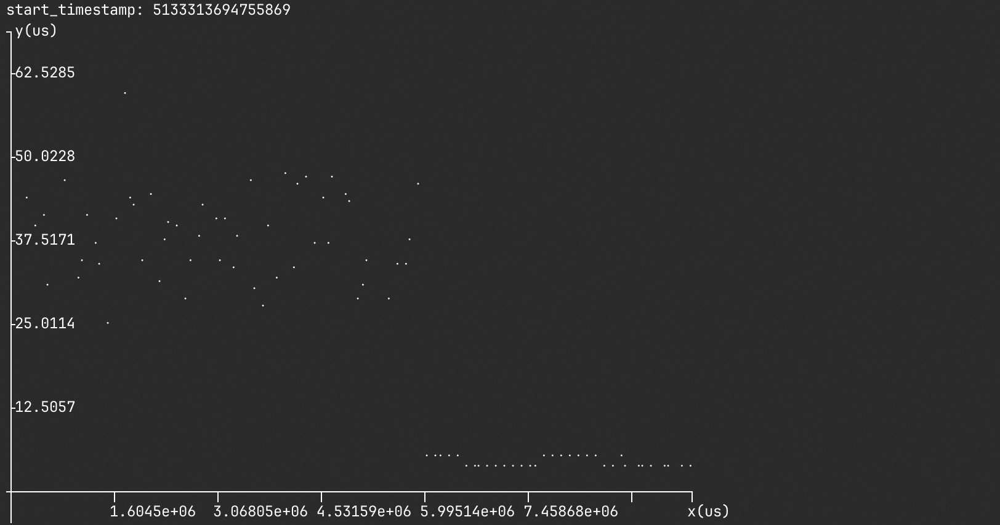
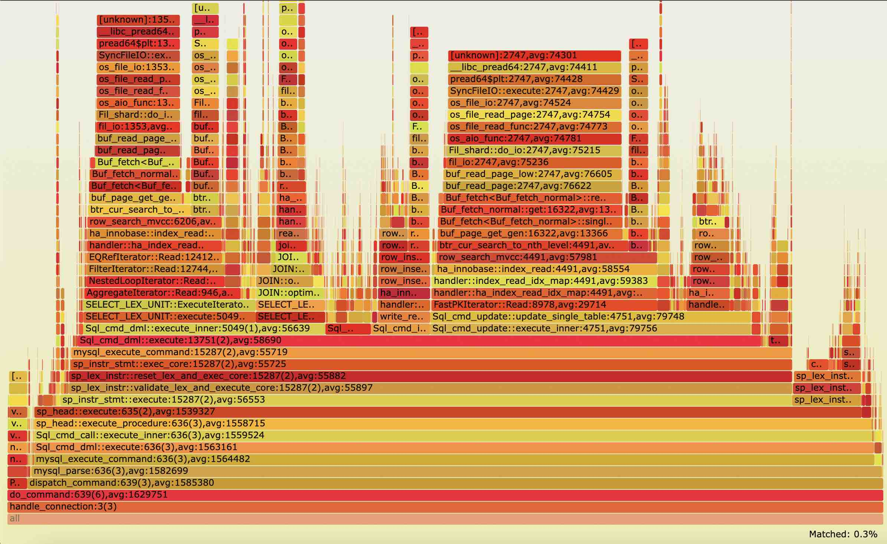

# PT_PERF ([中文](./README_CN.md))

PT_PERF is a tool for tracing and analysing the performance of runing program, or saves the trace data for historical analysis.

It is base on Intel Processor trace (Intel-pt), which traces the data of program control flow and timings, to reconstruct the exact exectution flows with less impact on program execution. PT_PERF makes use of the pt data to show the critical information such as function latency, call chain, etc.

The collection and decoding of trace data rely on the Linux perf tool. One can use "perf record" and "perf script" to trace and decode pt data，and they are integrated into PT_PERF. To speed up the decoding, we have modified the perf tool to support 'perf script' in parallel.

**PT_PERF Supported:**

=>  Function analysis

- Show the histogram of the target function latency.
- Show the sub-function latency. 
- Show the function latency grouped by caller.
- Show the On-cpu and Off-cpu (schedule) time respectively. 

=> Timeline analysis (base on [Table-and-Graph-Libs](https://github.com/tdulcet/Table-and-Graph-Libs))

- Show the function latency curve for each thread.
- Analyze the trace data in a specific time range.
- Show the call stack at a specific time point.

=>  Flamegraph (base on [FlamegGraph](https://github.com/brendangregg/FlameGraph))

- Latency based，using [pt_flame](https://github.com/mysqlperformance/pt-flame) to generate call chains.


- Cpu-time based。

=>  Historical analysis

- Trace the full amount of data first, and then do the analysis on-the-fly.

## Usage

```shell
Intel processor tool - func_latency
usage ./func_latency [-b bin/mysqld] [-f func] [-p pid] [-d trace_time] [-P perf_tool] [-s] [-i]
Linux version 4.2+ is required for Intel PT
Linux version 5.10+ is required for IP filtering when tracing
        -b / --binary          --- binary file path, empty for kernel function
        -f / --func            --- target's func name
        -d / --duration        --- trace time (seconds), 0.01 seconds by default
        -p / --pid             --- existing process ID
        -T / --tid             --- existing thread ID (comma separated list), example like tid1,tid2
        -C / --cpu             --- cpu list to trace, example like 0-47
        -w / --worker_num      --- parallel worker num, 10 by default
        -s / --parallel_script --- if use parallel script
        -t / --per_thread      --- use per_thread mode to trace data, better in multi-cores
        -o / --offcpu          --- trace offcpu time at the same time, which requires root privilege
        -i / --ip_filter       --- use ip_filter when tracing function
        -I / --func_idx        --- for ip_filter, choose function index if there exists multiple one, '#0' by default
        -P / --perf            --- perf tool path, 'perf' by default
        -a / --ancestor        --- only analyze target function with 'ancestor' function in its call chain,
                                   eg, 'test#100,200', we shows the result of target function
                                   where its ancestor latency is between 100ns and 200 ns.
        -c / --code_block      --- show the code block latency of target function
             --srcline         --- show the address, source file and line number of functions
             --history         --- for history trace, 1: generate perf.data, 2: use perf.data
             --pt_config       --- set config term for intel pt event, currently 'cyc=1' by default
        --li/--latency_interval--- show the trace between the latency interval (ns), format: "min,max"
        -v / --verbose         --- verbose, be more verbose (show debug message, etc)
        -h / --help            --- show this help

Timeline mode:
        -l / --timeline        --- show the target's func's latency by timeline for each thread
        --ti/--time_interval   --- show the trace between the time interval (ns), format:"start,min,max"
        --tu/--timeline_unit   --- the unit size in the timeline grapth, we caculate the average
                                   latency in the unit, 1 by default

Flamegraph mode:
        -F / --flamegraph      --- show the flamegraph, "latency, cpu"
             --pt_flame        --- the installed path of pt_flame, latency-based flamegraph required
```

### Environment

- Increases the 'perf_event_mlock_kb' to reduce trace data loss.
- Allow to trace kernel function.

```shell
sudo bash -c "su -"
echo 131072 > /proc/sys/kernel/perf_event_mlock_kb
echo -1 > /proc/sys/kernel/perf_event_paranoid
echo 0 > /proc/sys/kernel/kptr_restrict
```

### Install from source code

#### Prepare

- Install dependencies of linux perf tool, for parallel script (using with -s ).

```shell
sudo yum install binutils binutils-devel elfutils-libelf-devel -y 
```

#### Build

```shell
make
```

### Command

#### 1: Function analysis.

- Use IP_filting (-i) to only trace the data of target function, for less data lost and fast decoding. Linux 5.10+ required.

```shell
./func_latency -b bin/mysqld -f "do_command" -d 1 -p 60416 -s -i -t
```

- Use full trace data, do filter when decoding. 

```shell
./func_latency -b bin/mysqld -f "do_command" -d 1 -p 60416 -s -t
```

- When a function has multiple definitions, use the -I argument to specify which symbol to use.

```shell
./func_latency -b bin/mysqld -f "do_command" -d 1 -p 60416 -s -i -t -I "#2"
```

- Show the oncpu and offcpu time (-o, root privilege required).

```shell
sudo ./func_latency -b bin/mysqld -f "do_command" -d 1 -p 60416 -s -i -t -o
```

- Analyze the latency of target function according to specified ancestor function (-a). For example, if "-f func_a -a func_b#1,100" is given, we can get the latency of func_a where its ancestor function func_b has the latency ranges from 1ns to 100ns. This is useful to analyze the bottleneck of function with long-tail latency.

```shell
sudo ./func_latency -b bin/mysqld -f "buf_page_get_gen" -a "do_command#1,100000" -d 1 -p 60416 -s -i -t
```

- In addition to including the latency of child function, also show the code block latency (-c). the code block is defined from the point one branch ends to the point another branch starts, we can analyze the most expensive instruction against the program assembly code.

```shell
sudo ./func_latency -b bin/mysqld -f "do_command" -d 1 -p 60416 -s -i -t -c
```

- Instead of showing the call address and filename, source line, we show the define line of functions.
```shell
sudo ./func_latency -b bin/mysqld -f "do_command" -d 1 -p 60416 -s -i -t --srcline
```

- Show the analysis in the latency range from 'min' nanosecond to 'max' nanosecond (--li/--latency_interval=min,max).

```shell
./func_latency -b bin/mysqld -f "do_command" -d 1 -p 60416 -s -i -t --li=0,200000
```

#### 2. Timeline analysis

- Show the function latency curve for each thread (-l), ''--tu/--timeline_unit' can be used to specify the step for averaging, with one dot per latency by default.

```shell
./func_latency -b bin/mysqld -f "do_command" -d 1 -p 60416 -s -i -t -l --tu=1
```

- Show the analysis in the time range with 'start' timestamp and from 'min' nanosecond to 'max' nanosecond (--ti/--time_interval=start,min,max).

```shell
./func_latency -b bin/mysqld -f "do_command" -d 1 -p 60416 -s -i -t -l --tu=1 --ti=5133313694755869,100000,200000
```

#### 3. Flamegraph

- Latency based: use 'pt_flame' to analyze the decode data，the figure is output to 'frame.svg'。

```shell
./func_latency --flamegraph="latency" -d 1 -p 60416 -t -s
```

- cpu based：sample the instruction on cpu。

```shell
./func_latency --flamegraph="cpu" -d 1 -p 60416 -t -s
```

#### 4. Historical analysis

- do trace data (--history=1), the trace data is saved to 'perf.data'. perf.data and program binaries with debugging information can be copied to other machines for analysis.

```shell
./func_latency -d 10 -p 60416 -t --history=1
```

- Use perf.data，and analyze (--history=2), which can use all the previous methods. 

```shell
./func_latency -b bin/mysqld -f "do_command" -d 1 -s -t -l --history=2
```

### Example

Test MySQL 8.0 under sysbench oltp_read_only (24 cores, 128 threads) workload.

```shell
[ 10s ] thds: 128 tps: 14361.84 qps: 229809.51 
[ 11s ] thds: 128 tps: 14527.77 qps: 232428.35 
[ 12s ] thds: 128 tps: 14351.81 qps: 229664.99 
[ 13s ] thds: 128 tps: 14549.71 qps: 232707.43 
[ 14s ] thds: 128 tps: 14346.20 qps: 229687.19 
[ 15s ] thds: 128 tps: 14334.92 qps: 229213.65 
[ 16s ] thds: 128 tps: 14169.18 qps: 226838.86        # start trace
[ 17s ] thds: 128 tps: 14054.97 qps: 224836.49 
[ 18s ] thds: 128 tps: 13833.66 qps: 221274.61 
[ 19s ] thds: 128 tps: 13967.35 qps: 223444.64 
[ 20s ] thds: 128 tps: 13811.13 qps: 220993.01 
[ 21s ] thds: 128 tps: 13991.60 qps: 223962.59 
[ 22s ] thds: 128 tps: 13825.28 qps: 221247.52 
[ 23s ] thds: 128 tps: 14108.98 qps: 225739.62 
[ 24s ] thds: 128 tps: 13837.81 qps: 221382.92 
[ 25s ] thds: 128 tps: 13953.96 qps: 223300.31 
```

- Collect the latency information of 'do_command' for 1s, and also show the on-cpu and off-cpu (schedule) time.

```shell
$ sudo ./func_latency -b "bin/mysqld" -f "do_command" -d 1 -p 60416 -s -i -t -o
Histogram - Latency of [do_command]:
          ns             : cnt        distribution        sched      distribution
      1024 -> 2047       : 0        |                    | 6        |                    |
      2048 -> 4095       : 0        |                    | 1        |                    |
      4096 -> 8191       : 0        |                    | 6        |                    |
      8192 -> 16383      : 0        |                    | 27       |                    |
     16384 -> 32767      : 132      |                    | 150      |                    |
     32768 -> 65535      : 8487     |***                 | 16063    |******              |
     65536 -> 131071     : 22384    |*******             | 27139    |**********          |
    131072 -> 262143     : 39483    |**************      | 33818    |************        |
    262144 -> 524287     : 56138    |********************| 52723    |********************|
    524288 -> 1048575    : 44559    |***************     | 39089    |**************      |
   1048576 -> 2097151    : 35373    |************        | 28610    |**********          |
   2097152 -> 4194303    : 4663     |*                   | 2167     |                    |
   4194304 -> 8388607    : 23       |                    | 12       |                    |
   8388608 -> 16777215   : 2        |                    | 2        |                    |
trace count: 211244, average latency: 610493 ns
sched count: 199813,   sched latency: 503275 ns, cpu percent: 2264 %
sched total: 205337, sched each time: 517752 ns
```

- Show the sub-function latency of 'do_command'.

```shell
Histogram - Child functions's Latency of [do_command]:
                    name                 : avg        cnt        call_line         sched_time cpu_pct(%) distribution (total)
Protocol_classic::get_command            : 502643     211244     sql_parse.cc:1378 495234     156.51    |********************|
asm_sysvec_call_function_single          : 192055     7          -                 189609     0.00      |                    |
dispatch_command                         : 107245     211347     sql_parse.cc:1438 8025       2096.98   |****                |
asm_sysvec_apic_timer_interrupt          : 50563      35         -                 43869      0.02      |                    |
__irqentry_text_start                    : 14598      195        -                 3143       0.22      |                    |
vio_description                          : 338        211347     sql_parse.cc:1420 5          7.03      |                    |
my_net_set_read_timeout                  : 40         422591     sql_parse.cc:1434 1          1.64      |                    |
Diagnostics_area::reset_diagnostics_area : 23         211244     sql_parse.cc:1337 1          0.46      |                    |
Protocol_classic::get_output_packet      : 10         422719     sql_parse.cc:1439 0          0.44      |                    |
Protocol_classic::get_net                : 7          211244     sql_parse.cc:1345 0          0.15      |                    |
```

- Show the latency of 'do_command' called from 'handle_connection'.

```shell
Histogram - Latency of [do_command] called from [handle_connection]:
          ns             : cnt        distribution        sched      distribution
      1024 -> 2047       : 0        |                    | 6        |                    |
      2048 -> 4095       : 0        |                    | 1        |                    |
      4096 -> 8191       : 0        |                    | 6        |                    |
      8192 -> 16383      : 0        |                    | 27       |                    |
     16384 -> 32767      : 132      |                    | 150      |                    |
     32768 -> 65535      : 8487     |***                 | 16063    |******              |
     65536 -> 131071     : 22384    |*******             | 27139    |**********          |
    131072 -> 262143     : 39483    |**************      | 33818    |************        |
    262144 -> 524287     : 56138    |********************| 52723    |********************|
    524288 -> 1048575    : 44559    |***************     | 39089    |**************      |
   1048576 -> 2097151    : 35373    |************        | 28610    |**********          |
   2097152 -> 4194303    : 4663     |*                   | 2167     |                    |
   4194304 -> 8388607    : 23       |                    | 12       |                    |
   8388608 -> 16777215   : 2        |                    | 2        |                    |
trace count: 211244, average latency: 610493 ns
sched count: 199813,   sched latency: 503275 ns, cpu percent: 2264 %
```

- Show the sub-function latency of 'do_command' called from 'handle_connection'.

```shell
Histogram - Child functions's Latency of [do_command] called from [handle_connection]:
                    name                 : avg        cnt        call_line         sched_time cpu_pct(%) distribution (total)
Protocol_classic::get_command            : 502643     211244     sql_parse.cc:1378 495234     156.51    |********************|
asm_sysvec_call_function_single          : 192055     7          -                 189609     0.00      |                    |
dispatch_command                         : 107194     211244     sql_parse.cc:1438 8012       2095.16   |****                |
asm_sysvec_apic_timer_interrupt          : 50563      35         -                 43869      0.02      |                    |
__irqentry_text_start                    : 14598      195        -                 3143       0.22      |                    |
vio_description                          : 338        211244     sql_parse.cc:1420 5          7.03      |                    |
my_net_set_read_timeout                  : 40         422488     sql_parse.cc:1434 1          1.64      |                    |
Diagnostics_area::reset_diagnostics_area : 23         211244     sql_parse.cc:1337 1          0.46      |                    |
Protocol_classic::get_output_packet      : 10         422488     sql_parse.cc:1439 0          0.44      |                    |
Protocol_classic::get_net                : 7          211244     sql_parse.cc:1345 0          0.15      |                    |
```

- Show the latency of code block.

```shell
Histogram - Child functions's Latency of [do_command]:
                    name                 : avg        cnt        call_line                            sched_time cpu_pct(%) distribution (total)
Protocol_classic::get_command            : 502643     211244     sql_parse.cc:1378                    495234     156.51    |********************|
asm_sysvec_call_function_single          : 192055     7          -                                    189609     0.00      |                    |
dispatch_command                         : 107245     211347     sql_parse.cc:1438                    8025       2096.98   |****                |
asm_sysvec_apic_timer_interrupt          : 50563      35         -                                    43869      0.02      |                    |
__irqentry_text_start                    : 14598      195        -                                    3143       0.22      |                    |
vio_description                          : 338        211347     sql_parse.cc:1420                    5          7.03      |                    |
my_net_set_read_timeout                  : 40         422591     sql_parse.cc:1434                    1          1.64      |                    |
Diagnostics_area::reset_diagnostics_area : 23         211244     sql_parse.cc:1337                    1          0.46      |                    |
Protocol_classic::get_output_packet      : 10         422719     sql_parse.cc:1439                    0          0.44      |                    |
*code block: 454-463                     : 18         10518      sql_parse.cc:1434-sql_parse.cc:1434  0          0.18      |                    |
*code block: 162-182                     : 17         10518      sql_parse.cc:1381-sql_parse.cc:1381  0          0.17      |                    |
*code block: 729-739                     : 17         10517      sql_parse.cc:1439-sql_parse.cc:1439  0          0.18      |                    |
*code block: 441-448                     : 4          10518      sql_string.h:387-sql_string.h:387    0          0.05      |                    |
*code block: 88-118                      : 3          10518      sql_class.h:4943-sql_parse.cc:1347   0          0.03      |                    |
*code block: 712-724                     : 1          10518      sql_parse.cc:1438-sql_parse.cc:1438  0          0.02      |                    |
*code block: 429-436                     : 1          10518      sql_parse.cc:1431-sql_parse.cc:1431  0          0.01      |                    |
*code block: 608-621                     : 1          10518      sql_string.h:388-sql_string.h:388    0          0.01      |                    |
*code block: 468-471                     : 0          10518      sql_parse.cc:1436-sql_parse.cc:1436  0          0.00      |                    |
*code block: 76-83                       : 0          10518      sql_parse.cc:1345-sql_parse.cc:1345  0          0.01      |                    |
...
```

- Trace full execution data, and save to 'perf.data'。

```shell
$ ./func_latency -d 10 -p 60416 -t --history=1
[ perf record: Woken up 0 times to write data ]
[ perf record: Captured and wrote 2863.829 MB perf.data ]
```

- Use the 'perf.data' to show latency curve of 'trx_commit' with thread id of 123173, plot one latency dot every 100 calls. In the figure, we change the commit policy at about 5 s, and the commit latency decreased.

```shell
$./func_latency -b bin/mysqld -f "trx_commit" -d 10 -t -s -l --tu=100 -T 123173 --history=2
```



- Show the latency-based flamegraph，including the average latency of each function.

```
  ./func_latency --flamegraph="latency" -d 1 -p 60416 -t -s
```


