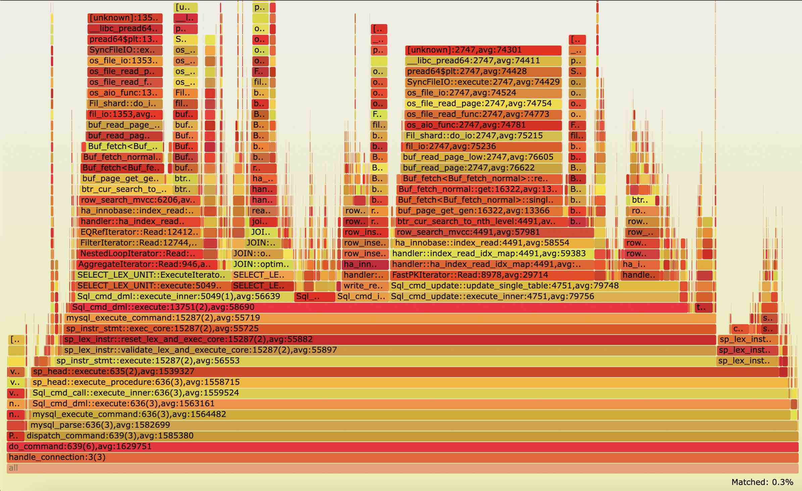

# PT_PERF

该工具基于 Intel Processor Trace（Intel-PT）的程序 trace 流，在程序运行时，对指定调用函数进行分析, 或者保存 trace 流，进行历史分析。

支持：

=> 函数分析

* 指定函数的时延分布直方图，平均时延。
* 按上层函数划分指定函数的时延分布。
* 给出指定函数的子函数调用时延。
* 支持函数时延按 On-CPU 和 Off-CPU (Schedule) 统计 (需要 root 权限)。

=> timeline 时间线分析

* 按线程给出函数时延随着 trace 时间的 timeline 变换图。
* 查看函数在某一时间段的 trace 数据，进行分析（函数或者火焰图分析）。
* 查看某个时间点的函数栈 pstack。

=> Flamegraph 火焰图分析

* 基于函数时延的火焰图：使用 [pt_flame](https://code.alibaba-inc.com/sunjingyuan.sjy/pt_flame) 对解码数据分析。


* cpu 火焰图：和传统基于 cpu 采样一致。

=> 历史分析

* 先 trace 某段时间全量数据，再分析 (可以在不同机器，需要拷贝二进制到相同目录)。

## Usage
```shell
Intel processor tool - func_latency
usage ./func_latency [-b bin/mysqld] [-f func] [-p pid] [-d trace_time] [-P perf_tool] [-s] [-i]
Linux version 4.2+ is required for Intel PT
Linux version 5.10+ is required for IP filtering when tracing
        -b / --binary          --- binary file path, empty for kernel func
        -f / --func            --- target's func name
        -d / --duration        --- trace time (seconds)
        -p / --pid             --- existing process ID
        -T / --tid             --- existing thread ID
        -C / --cpu             --- cpu list to trace, example like 0-47
        -w / --worker_num      --- parallel worker num, 10 by default
        -s / --parallel_script --- if use parallel script
        -t / --per_thread      --- use per_thread mode to trace data, better in multi-cores
        -o / --offcpu          --- trace offcpu time at the same time, which requires root privilege
        -i / --ip_filter       --- use ip_filter when tracing function
        -I / --func_idx        --- for ip_filter, choose function index if there exists multiple one, '#0' by default
        -P / --perf            --- perf tool path, 'perf' by default
             --history         --- for history trace, 1: generate perf.data, 2: use perf.data
        -v / --verbose         --- verbose, be more verbose (show debug message, etc)
        -h / --help            --- show this help

Timeline mode:
        -l / --timeline        --- show the target's func's latency by timeline for each thread
        --li/--latency_interval--- show the trace between the latency interval (ns), format: "min,max"
        --ti/--time_interval   --- show the trace between the time interval (ns), format:"start,min,max"
        --tu/--timeline_unit   --- the unit size in the timeline grapth, we caculate the average
                                   latency in the unit, 1 by default

Flamegraph mode:
        -F / --flamegraph      --- show the flamegraph, "latency, cpu"
             --pt_flame        --- the installed path of pt_flame, latency-based flamegraph required
```

### 快速安装

通过 yum 安装，func_latency 和定制的 perf 二进制会安装在 /usr/share/pt_func_perf 目录下。

```shell
yum install pt_func_perf -b test
/usr/share/pt_func_perf/func_latency --help
```

### 环境配置

* 增大系统 perf_event_mlock_kb 大小，减少 trace 数据丢失。
* 使用 per-thread 模式，性能衰减更低，减少 switch 事件。
* trace 内核函数，offcpu 统计需要。

```shell
sudo bash -c "su -"
echo 131072 > /proc/sys/kernel/perf_event_mlock_kb
echo -1 > /proc/sys/kernel/perf_event_paranoid
echo 0 > /proc/sys/kernel/kptr_restrict
```

### 源码安装

#### Prepare

* 安装并行 script 的 perf 工具依赖库，加快 script 速度（-s 参数开启）。

```shell
# 安装支持 symbol 解析库
sudo yum install binutils-devel elfutils-libelf-devel -y 
```

#### Build

```shell
make
```

### Usage

#### 场景一：函数分析，查看程序运行时，函数执行信息。

  * 使用 IP_filting（-i）可以只 trace 指定函数，数据基本不丢失，不过需要在 Linux 5.10+ 版本支持。

  ```shell
./func_latency -b bin/mysqld -f "do_command" -d 1 -p 60416 -s -i -t
  ```

  * 不支持 IP_filting 可使用全量 trace 所有函数（适合历史分析），再过滤。缺点：速度慢，采样数据量大，容易丢数据，可能会出现由于缺栈的异常较大时延，perf 内部实现了 script 期间的 ip_filing，可进行加速，大约比全量 快 5 倍。

  ```shell
./func_latency -b bin/mysqld -f "do_command" -d 1 -p 60416 -s -t
  ```

  * 当函数有多个定义时，可以使用 -I 参数指定使用第几个 symbol。

  ```shell
./func_latency -b bin/mysqld -f "do_command" -d 1 -p 60416 -s -i -t -I "#2"
  ```

  * 查看函数执行时 oncpu 和 offcpu 时延比例 (-o, 需要 root 权限)，目前只支持 ip_filting (-i) 情况下。

  ```shell
sudo ./func_latency -b bin/mysqld -f "do_command" -d 1 -p 60416 -s -i -t -o
  ```

* 查看函数时延在 min 纳秒到 max 纳秒的函数执行信息 (--li/--latency_interval=min,max)。

```shell
./func_latency -b bin/mysqld -f "do_command" -d 1 -p 60416 -s -i -t --li=0,200000
```

#### 场景二：时间线分析。

  * 查看函数时延随着时间线分布图 (-l)，可以通过 --tu/--timeline_unit 指定求平均打点的 step，默认每个时延打一个点。

  ```shell
./func_latency -b bin/mysqld -f "do_command" -d 1 -p 60416 -s -i -t -l --tu=1
  ```

* 查看时间从采样时间 start 开始, min 纳秒到 max 纳秒的时延（ --ti/--time_interval=start,min,max）。

```shell
./func_latency -b bin/mysqld -f "do_command" -d 1 -p 60416 -s -i -t -l --tu=1 --ti=5133313694755869,100000,200000
```

#### 场景三：火焰图分析。

* 基于函数时延的火焰图：使用 [pt_flame](https://code.alibaba-inc.com/sunjingyuan.sjy/pt_flame) 对解码数据分析，火焰图输出在 flame.svg 中。

```shell
./func_latency --flamegraph="latency" -d 1 -p 60416 -t -s
```

* cpu 火焰图：和传统基于 cpu 采样一致。

```shell
./func_latency --flamegraph="cpu" -d 1 -p 60416 -t -s
```

#### 场景四：历史数据分析。

  * trace 数据 (--history=1)，相当于 perf record 保存数据在 perf.data 中。可以将 perf.data 和带有调试信息的程序二进制拷贝到其他机器进行分析。

  ```shell
./func_latency -d 10 -p 60416 -t --history=1
  ```

  * 使用 perf.data，并分析 trace 数据 (--history=2)，可以用前面所有场景分析，通过 -T 查看指定某个线程的 trace。

  ```shell
./func_latency -b bin/mysqld -f "do_command" -d 1 -s -t -l --history=2
  ```

### Example

#### 场景一：函数分析，查看程序运行时，函数执行信息。

在 sysbench oltp_read_only（24 cores, 128 threads）负载下测试。  

```Shell
[ 10s ] thds: 128 tps: 14361.84 qps: 229809.51 
[ 11s ] thds: 128 tps: 14527.77 qps: 232428.35 
[ 12s ] thds: 128 tps: 14351.81 qps: 229664.99 
[ 13s ] thds: 128 tps: 14549.71 qps: 232707.43 
[ 14s ] thds: 128 tps: 14346.20 qps: 229687.19 
[ 15s ] thds: 128 tps: 14334.92 qps: 229213.65 
[ 16s ] thds: 128 tps: 14169.18 qps: 226838.86        # start trace
[ 17s ] thds: 128 tps: 14054.97 qps: 224836.49 
[ 18s ] thds: 128 tps: 13833.66 qps: 221274.61 
[ 19s ] thds: 128 tps: 13967.35 qps: 223444.64 
[ 20s ] thds: 128 tps: 13811.13 qps: 220993.01 
[ 21s ] thds: 128 tps: 13991.60 qps: 223962.59 
[ 22s ] thds: 128 tps: 13825.28 qps: 221247.52 
[ 23s ] thds: 128 tps: 14108.98 qps: 225739.62 
[ 24s ] thds: 128 tps: 13837.81 qps: 221382.92 
[ 25s ] thds: 128 tps: 13953.96 qps: 223300.31 
```

* 统计 do_command 运行 1s 的时延分布, 查看 schedule 时延。

```shell
$ sudo ./func_latency -b "bin/mysqld" -f "do_command" -d 1 -p 60416 -s -i -t -o
Histogram - Latency of [do_command]:
          ns             : cnt        distribution        sched      distribution
      1024 -> 2047       : 0        |                    | 6        |                    |
      2048 -> 4095       : 0        |                    | 1        |                    |
      4096 -> 8191       : 0        |                    | 6        |                    |
      8192 -> 16383      : 0        |                    | 27       |                    |
     16384 -> 32767      : 132      |                    | 150      |                    |
     32768 -> 65535      : 8487     |***                 | 16063    |******              |
     65536 -> 131071     : 22384    |*******             | 27139    |**********          |
    131072 -> 262143     : 39483    |**************      | 33818    |************        |
    262144 -> 524287     : 56138    |********************| 52723    |********************|
    524288 -> 1048575    : 44559    |***************     | 39089    |**************      |
   1048576 -> 2097151    : 35373    |************        | 28610    |**********          |
   2097152 -> 4194303    : 4663     |*                   | 2167     |                    |
   4194304 -> 8388607    : 23       |                    | 12       |                    |
   8388608 -> 16777215   : 2        |                    | 2        |                    |
trace count: 211244, average latency: 610493 ns
sched count: 199813,   sched latency: 503275 ns, cpu percent: 2264 %
sched total: 205337, sched each time: 517752 ns
```

* do_command 的子函数平均时延。

```shell
Histogram - Child functions's Latency of [do_command]:
                    name                 : avg        cnt        sched_time cpu_pct(%) distribution (total)
Protocol_classic::get_command            : 502643     211244     495234     156.51    |********************|
asm_sysvec_call_function_single          : 192055     7          189609     0.00      |                    |
dispatch_command                         : 107245     211347     8025       2096.98   |****                |
asm_sysvec_apic_timer_interrupt          : 50563      35         43869      0.02      |                    |
__irqentry_text_start                    : 14598      195        3143       0.22      |                    |
vio_description                          : 338        211347     5          7.03      |                    |
my_net_set_read_timeout                  : 40         422591     1          1.64      |                    |
Diagnostics_area::reset_diagnostics_area : 23         211244     1          0.46      |                    |
Protocol_classic::get_output_packet      : 10         422719     0          0.44      |                    |
Protocol_classic::get_net                : 7          211244     0          0.15      |                    |
```

* do_command 来自父函数 handle_connection 的时延分布。

```shell
Histogram - Latency of [do_command] called from [handle_connection]:
          ns             : cnt        distribution        sched      distribution
      1024 -> 2047       : 0        |                    | 6        |                    |
      2048 -> 4095       : 0        |                    | 1        |                    |
      4096 -> 8191       : 0        |                    | 6        |                    |
      8192 -> 16383      : 0        |                    | 27       |                    |
     16384 -> 32767      : 132      |                    | 150      |                    |
     32768 -> 65535      : 8487     |***                 | 16063    |******              |
     65536 -> 131071     : 22384    |*******             | 27139    |**********          |
    131072 -> 262143     : 39483    |**************      | 33818    |************        |
    262144 -> 524287     : 56138    |********************| 52723    |********************|
    524288 -> 1048575    : 44559    |***************     | 39089    |**************      |
   1048576 -> 2097151    : 35373    |************        | 28610    |**********          |
   2097152 -> 4194303    : 4663     |*                   | 2167     |                    |
   4194304 -> 8388607    : 23       |                    | 12       |                    |
   8388608 -> 16777215   : 2        |                    | 2        |                    |
trace count: 211244, average latency: 610493 ns
sched count: 199813,   sched latency: 503275 ns, cpu percent: 2264 %
```

* do_command 来自 handle_connection 的子函数调用时延。

```shell
Histogram - Child functions's Latency of [do_command] called from [handle_connection]:
                    name                 : avg        cnt        sched_time cpu_pct(%) distribution (total)
Protocol_classic::get_command            : 502643     211244     495234     156.51    |********************|
asm_sysvec_call_function_single          : 192055     7          189609     0.00      |                    |
dispatch_command                         : 107194     211244     8012       2095.16   |****                |
asm_sysvec_apic_timer_interrupt          : 50563      35         43869      0.02      |                    |
__irqentry_text_start                    : 14598      195        3143       0.22      |                    |
vio_description                          : 338        211244     5          7.03      |                    |
my_net_set_read_timeout                  : 40         422488     1          1.64      |                    |
Diagnostics_area::reset_diagnostics_area : 23         211244     1          0.46      |                    |
Protocol_classic::get_output_packet      : 10         422488     0          0.44      |                    |
Protocol_classic::get_net                : 7          211244     0          0.15      |                    |
```

#### 场景二：先 trace，后解析，并查看指定时间段/范围的函数性能 summary。

* trace 10s 的全量数据。得到 perf.data。

```shell
$ ./func_latency -d 10 -p 60416 -t --history=1
[ perf record: Woken up 0 times to write data ]
[ perf record: Captured and wrote 2863.829 MB perf.data ]
```
* 使用历史数据查看 trx_commit 线程 id 为 123173 的时间分布，每 100 次 latency 取平均，也可以通过 -ti=start,min,max 缩小时间范围查看，或者 -li=min,max 缩小查看具体时延范围的 profile。图中在 5 s 的时候做过一次落盘切换，commit 时间发生改变。

```shell
$./func_latency -b bin/mysqld -f "trx_commit" -d 10 -t -s -l --tu=100 -T 123173 --history=2
```


#### 场景三：火焰图分析。

* 使用 latency 火焰图查看，每个 function 包括对应的时延平均值。

```shell
./func_latency --flamegraph="latency" -d 1 -p 60416 -t -s
```


